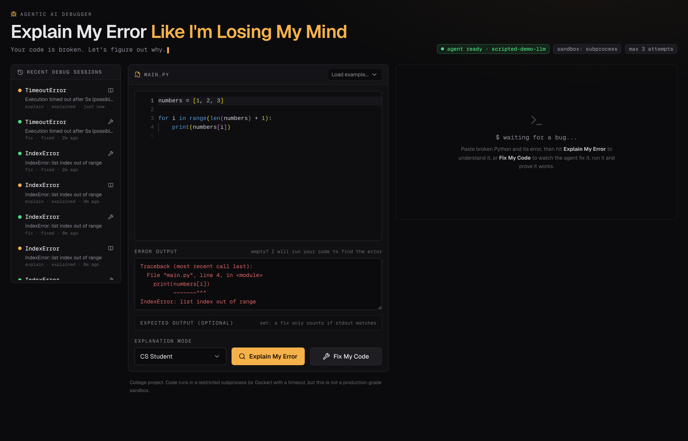
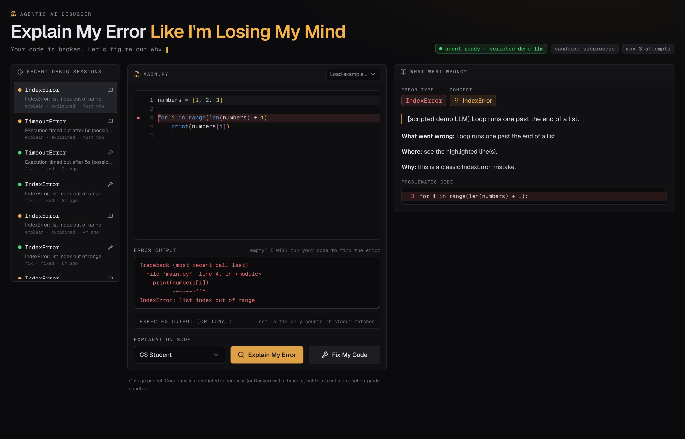
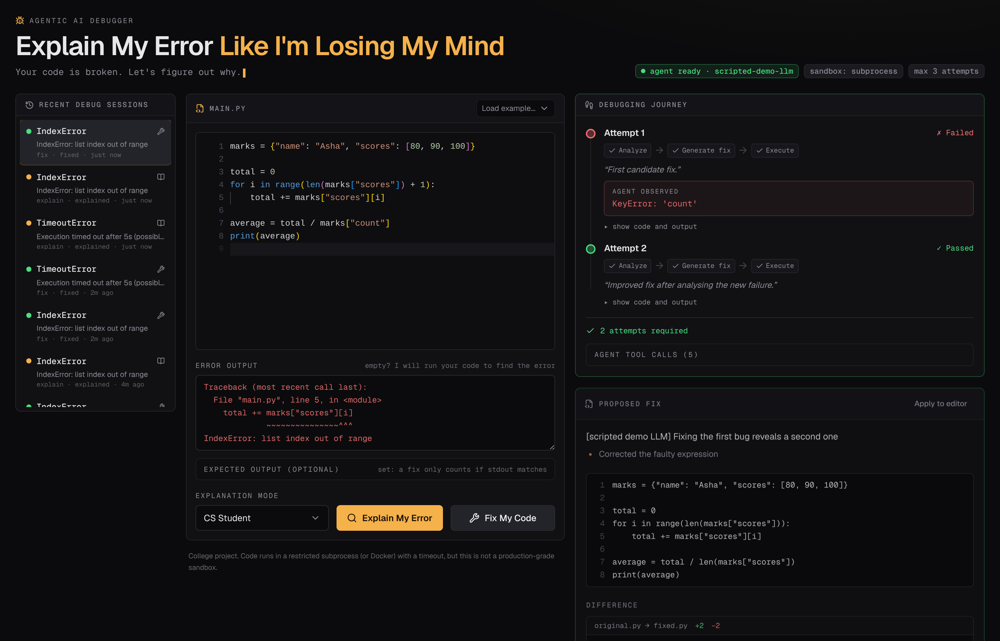
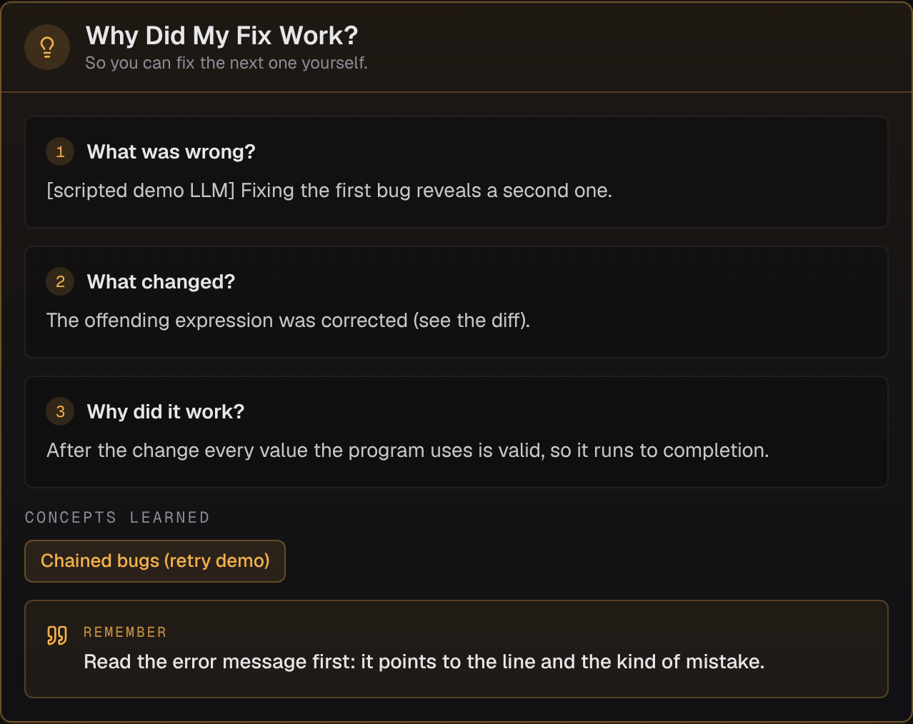

<div align="center">

# Explain My Error Like I'm Losing My Mind

### An Agentic AI Debugging & Code-Explanation Assistant

*Your code is broken. Let's figure out why.*

</div>



---

## 1. Problem statement

A Python traceback tells you *where* the interpreter gave up, not *what you misunderstood*.
`IndexError: list index out of range` names the symptom; the mistake was thinking a list of
length 3 has an index 3. Beginners paste the traceback into a chatbot, get a corrected file back,
copy it in, and learn nothing — and when the suggested fix is wrong, they have no way to tell.

## 2. Motivation

An LLM that hands back code is guessing out loud. This project asks a different question: **can
the assistant prove its fix works, and explain why it works?**

That turns one prompt into a loop — propose, run, observe, correct — and the loop is the whole
point. It is also what makes the output trustworthy: the green "FIX VERIFIED" badge means the
corrected program was actually executed and actually exited 0, not that a model said so.

## 3. Features

- **Explain My Error** in four styles: Like I'm 5 / CS Student / Interview / Technical.
- **Fix My Code** — the agent writes a fix, *runs it*, reads the result, and retries up to 3 times.
- **Why Did My Fix Work?** — what was wrong, what changed, why that solves it, the concepts
  involved, and one thing to remember.
- **Debugging journey** — every attempt, its rationale, what the agent observed, and the exact
  tool calls, streamed live as they happen.
- **Visual diff**, **verification badge**, and the real stdout/stderr of each run.
- **No error message? No problem** — the agent runs your code to reproduce it first.
- **Expected output** (optional) — catches bugs that do not crash but print the wrong thing.
- **Debug history** in SQLite; click any past session to reopen it.
- **Works without an LLM key** for explanations: falls back to a real static analyzer.

## 4. Architecture

```
User → Next.js frontend → FastAPI → Agent (OpenAI Agents SDK)
                                      ├── analyze_code     (AST analysis, no LLM)
                                      ├── execute_python   (sandboxed subprocess / Docker)
                                      └── generate_diff
                                            ↓
                                    Execution result
                                            ↓
                                     Agent decision
                                   ├── success → explain why
                                   └── failure → analyze, retry (max 3)
```

Full diagrams and rationale: **[docs/architecture.md](docs/architecture.md)**.

## 5. Agentic workflow

```
receive code + error
   → analyze_code
   → generate candidate fix
   → execute_python          ← the agent cannot run code any other way
   → observe stdout / stderr / exit code / timeout
   → passed?  yes → verify → "Why did my fix work?"
              no  → attempts left? → analyze the NEW error → new fix → execute again
                                   → budget spent → failure summary with every attempt
```

The model proposes; **the sandbox decides**. Success is read from the exit code (and an exact
stdout match when an expected output is given), so a confident wrong answer still fails.

Full trace of a real two-attempt run: **[docs/agent-workflow.md](docs/agent-workflow.md)**.

## 6. Tech stack

| Layer | Choice |
|---|---|
| Frontend | Next.js 16 (App Router), TypeScript (strict), Tailwind CSS v4, shadcn/ui-style components, Monaco Editor, Lucide icons |
| Backend | Python 3.11+, FastAPI, Pydantic v2 |
| Agent | OpenAI Agents SDK, any OpenAI-compatible provider |
| Execution | subprocess sandbox (default) or Docker |
| Storage | SQLite |
| Tests | pytest (91 tests, no API key needed) |

## 7. Installation

Requires **Python 3.11+** and **Node.js 20+**.

```bash
git clone <your-repo-url>
cd explain-my-error
```

### Backend

```bash
cd backend
python3 -m venv .venv
source .venv/bin/activate          # Windows: .venv\Scripts\activate
pip install -r requirements-dev.txt    # or requirements.txt without the test tools
```

### Frontend

```bash
cd ../frontend
npm install                        # also copies Monaco into public/ for offline use
```

## 8. Environment variables

```bash
cp .env.example backend/.env       # then edit backend/.env
```

| Variable | Default | Meaning |
|---|---|---|
| `OPENAI_API_KEY` | — | Required for **Fix My Code**. Without it, explanations fall back to static analysis. |
| `OPENAI_MODEL` | `gpt-4o-mini` | Any chat model your provider serves. |
| `OPENAI_BASE_URL` | *(empty)* | Set for Groq / OpenRouter / Ollama / a local server. |
| `MAX_ATTEMPTS` | `3` | Executions the agent may spend on one bug (1–5). |
| `EXECUTION_BACKEND` | `subprocess` | `subprocess` or `docker`. |
| `EXECUTION_TIMEOUT` | `5` | Seconds before a run is killed. |
| `MAX_OUTPUT_SIZE` | `10000` | Bytes kept per stream. |
| `EXECUTION_MEMORY_MB` | `512` | Memory cap for executed code. |
| `DATABASE_URL` | `sqlite:///./data/debug_history.db` | History database. |
| `CORS_ORIGINS` | `http://localhost:3000,...` | Allowed frontend origins. |
| `NEXT_PUBLIC_API_URL` | `http://localhost:8000` | Backend URL, in `frontend/.env.local`. |

Never commit a real key; `.env` is git-ignored.

## 9. Running locally

Two terminals.

**Terminal 1 — backend**

```bash
cd backend
source .venv/bin/activate
uvicorn app.main:app --reload --port 8000
```

**Terminal 2 — frontend**

```bash
cd frontend
npm run dev
```

Open **http://localhost:3000**. API docs: **http://localhost:8000/docs**.

### With Docker

```bash
cp .env.example .env     # put your key in it
docker compose up --build
```

### Without any API key (offline demo)

A scripted stand-in speaks the OpenAI protocol and knows the built-in example bugs. It is **not a
model** — it replays fixed answers — but it demonstrates the full agent loop, including the retry:

```bash
cd backend
source .venv/bin/activate
uvicorn tests.fake_llm_server:app --port 9999 &
OPENAI_API_KEY=anything OPENAI_BASE_URL=http://localhost:9999/v1 \
  OPENAI_MODEL=scripted-demo-llm uvicorn app.main:app --port 8000
```

Its text is prefixed `[scripted demo LLM]` so nobody mistakes it for real output.

## 10. Example usage

### Explain

```bash
curl -X POST http://localhost:8000/api/debug \
  -H 'Content-Type: application/json' \
  -d '{
    "mode": "explain",
    "code": "numbers = [1, 2, 3]\n\nfor i in range(len(numbers) + 1):\n    print(numbers[i])\n",
    "error": "IndexError: list index out of range",
    "explanation_mode": "cs_student"
  }'
```

```jsonc
{
  "id": 1, "mode": "explain", "status": "explained", "error_type": "IndexError",
  "explanation": {
    "error_type": "IndexError",
    "summary": "The loop asks for index 3 of a three-item list.",
    "explanation": "**What went wrong:** ...",
    "concept": "Zero-based indexing",
    "problematic_lines": [3],
    "problematic_code": "  3 | for i in range(len(numbers) + 1):",
    "source": "llm"
  },
  "tool_trace": [{ "tool": "analyze_code", "summary": "IndexError at line 4: ...", "by": "orchestrator" }]
}
```

### Fix

```bash
curl -X POST http://localhost:8000/api/debug \
  -H 'Content-Type: application/json' \
  -d '{"mode":"fix","code":"numbers = [1, 2, 3]\n\nfor i in range(len(numbers) + 1):\n    print(numbers[i])\n","error":"IndexError: list index out of range","expected_output":"1\n2\n3"}'
```

Returns `attempts[]` (each with the code run and its real stdout/stderr/exit code), `fix.diff`,
`fix.verified` and `why_it_worked`.

### Watch the loop live (SSE)

```bash
curl -N -X POST http://localhost:8000/api/debug/stream \
  -H 'Content-Type: application/json' -d @request.json
```

```
event: attempt_running   data: {"attempt": 1, "rationale": "..."}
event: attempt_result    data: {"attempt": 1, "data": {"success": false, ...}}
event: attempt_started   data: {"attempt": 2}
event: attempt_result    data: {"attempt": 2, "data": {"success": true, ...}}
event: result            data: {"response": { ... }}
```

### Other endpoints

```
GET  /api/health                  # is a key configured? which model? which sandbox?
GET  /api/debug/history           # recent sessions
GET  /api/debug/history/{id}      # reopen one
```

The brief offered separate `/explain`, `/fix` and `/execute` routes or one consolidated route.
**One `POST /api/debug` with a `mode` field** was chosen: the two tasks share the whole pipeline
(validate → reproduce → analyze → …) and differ only at the last step, so splitting them would
duplicate that pipeline. `/api/debug/stream` is the same endpoint with SSE progress.

## 11. Testing

```bash
cd backend
source .venv/bin/activate
pytest -q                       # 91 tests, no API key, no network, ~16s
pytest tests/test_executor.py   # sandbox only
pytest -q -k "retry or budget"  # the agent loop
```

Frontend:

```bash
cd frontend
npm run typecheck   # tsc --noEmit, strict mode
npm run lint
npm run build
```

## 12. Screenshots

| | |
|---|---|
| **Explanation** — error type, concept, the exact lines |  |
| **The agent loop running** — attempt 1 failed, the agent reports what it observed |  |
| **Why Did My Fix Work?** |  |

Full verified-fix view: [`docs/screenshots/04-fix-verified.png`](docs/screenshots/04-fix-verified.png).

## 13. Evaluation methodology

`backend/evaluate.py` runs the agent against 18 fixtures (`backend/tests/fixtures/bugs.json`)
covering IndexError, TypeError, KeyError, NameError, ValueError, AttributeError,
ZeroDivisionError, SyntaxError, off-by-one, wrong conditional, infinite loop, bad list mutation,
missing return, wrong dict access, wrong arguments, UnboundLocalError, ImportError, and one
chained two-bug case.

For each fixture the harness runs the buggy code to get the **real** error, then scores: error
identification accuracy, first-attempt fix rate, overall fix rate, average attempts per success,
and structural explanation completeness.

```bash
python evaluate.py              # writes evaluation_results.json / .md
```

**This README publishes no scores.** Results depend on the model you configure, and inventing
numbers would defeat the exercise — run it with your own key and paste the generated table in.
Method, scoring rules and caveats: **[docs/evaluation.md](docs/evaluation.md)**.

## 14. Why this qualifies as an agentic AI system

| Requirement | Evidence in this project |
|---|---|
| **Reasoning** | The model diagnoses the root cause and plans a minimal fix, then re-reasons about each new failure. |
| **Tool use** | Three real tools; the model cannot execute code any other way. Calls are logged and shown. |
| **Action** | Candidate fixes are really executed in a sandbox. |
| **Observation** | stdout, stderr, exit code and timeout flags are fed back into the conversation. |
| **Iterative correction** | A failed attempt triggers re-analysis and a different fix, up to the budget. |
| **Verification** | Success is the sandbox's verdict, never the model's claim — enforced in code and in tests. |
| **Termination** | A hard budget, enforced by the tool itself, not by prompt instructions alone. |

The honest counter-question — *couldn't one good LLM call do this?* — is answered by the
`chained_two_bugs` case: the second bug is invisible until the first fix runs. Only a loop that
executes and observes can find it.

## 15. Limitations

- **Python only**, single file, standard library only. No `input()` (stdin is closed).
- **The sandbox is not production-grade.** The default subprocess backend gives a timeout, a
  stripped environment with no secrets, CPU/memory/output caps and blocked network calls, but it
  is not a security boundary against hostile code. Use `EXECUTION_BACKEND=docker`, and never
  expose this publicly.
- **The Docker backend needs its image pulled first** (`docker pull python:3.12-slim`). If the
  daemon or the image is unavailable it logs why and falls back to the subprocess sandbox. Its
  command construction and fallback logic are unit-tested, but the container path was not
  runtime-verified in the restricted environment this was built in — run it once yourself before
  relying on it for the demo.
- **Three attempts** fix shallow, local bugs. Design flaws, multi-file projects and bugs needing
  domain knowledge are out of reach.
- **Without `expected_output`, "runs without crashing" is the bar.** A fix can satisfy it and
  still be wrong; the brief's "wrong conditional"-style bugs need an expected output to be caught.
- **A wrong fix can be verified** if it coincidentally produces the right output (e.g. hard-coding
  a value). The prompt forbids it and the diff makes it visible, but nothing enforces it.
- **Explanation quality is the model's**, and is only checked structurally.
- **No authentication, no rate limiting, no multi-user isolation.** History is global.
- The agent sees only the code you paste — not your real project, imports or data.

## 16. Future improvements

1. **Semantic evaluation** — a grader model (or human rubric) scoring explanation *correctness*,
   not just completeness.
2. **Generate tests, not just output comparison** — have the agent propose assertions, so
   "verified" means "behaves correctly", not "does not crash".
3. **gVisor / Firecracker isolation**, or a per-run ephemeral container with seccomp.
4. **Multi-file and traceback-driven context**, so real projects can be debugged.
5. **A "teach me" mode** that gives a hint first and only reveals the fix after an attempt.
6. **Spaced repetition over the concepts** collected in history — the data is already stored.
7. **Streaming token output** for explanations, as the agent writes them.

## 17. Notes for the presentation

Three demos, in this order:

1. **Explain** — the `IndexError` example, style on *CS Student*. Point out that `analyze_code`
   ran first and that the editor highlights line 3 (the `range`), not line 4 where Python
   reported the crash: the root cause, not the symptom.
2. **Fix (one attempt)** — same bug, click *Fix My Code*. Show the attempt card, the diff, the
   green **FIX VERIFIED**, then "Why Did My Fix Work?".
3. **Fix (two attempts)** — load **"Two bugs: first fix fails (retry demo)"**. This is the one
   that matters. Attempt 1 fails with `KeyError: 'count'`, the "Agent observed" box appears, the
   agent re-analyzes and attempt 2 passes. Say the line out loud: *a single LLM call could not
   have found the second bug, because it only became visible after the first fix ran.*

Then open the **Agent tool calls** list to show the real sequence, and have
`docs/agent-workflow.md` open for the architecture question.

Two questions to be ready for:

- *"How do you know the fix is correct?"* — The sandbox exit code, plus an exact stdout match when
  an expected output is set. Then concede the limitation honestly: a coincidentally-correct fix
  would pass, which is why generating assertions is the first thing on the future-work list.
- *"Why not LangGraph?"* — One agent, three tools, one loop. The Agents SDK expresses that
  directly; a graph framework would add concepts without removing code.

Have the offline scripted-LLM mode ready as a backup in case the venue's network or your API quota
fails mid-demo.

---

*Built as a final-year Generative AI / Agentic AI project. Development/educational software, not a
production code-execution service.*
