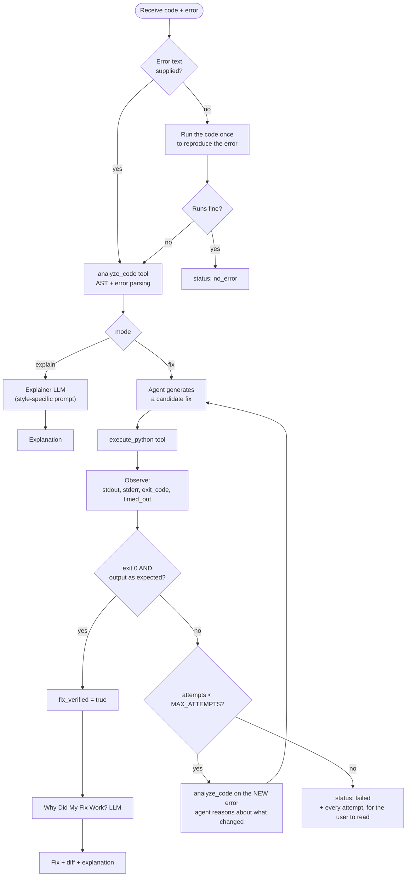

# The agentic workflow

## 1. Why this is an agent and not a chatbot

A chatbot maps one prompt to one answer. This system **acts, observes the real world, and changes
its mind**. Concretely:

| Agentic property | Where it happens | How you can see it |
|---|---|---|
| Tool calling | `analyze_code`, `execute_python`, `generate_diff` | "Agent tool calls" list in the UI |
| Action | the agent runs its candidate fix in a sandbox | Attempt cards |
| Observation | stdout / stderr / exit code / timeout fed back to the model | "Agent observed: KeyError: 'count'" |
| Iterative correction | a failed attempt triggers re-analysis and a new fix | Attempt 1 ✗ → Attempt 2 ✓ |
| Verification | success is the sandbox's verdict, not the model's claim | "✓ FIX VERIFIED" |
| Termination | hard budget of `MAX_ATTEMPTS` executions | "2 attempts required" / failure summary |

The decisive detail: **the model is not allowed to decide whether it succeeded.** `DebugService`
reads the exit code (and, when an expected output was given, compares stdout) and overrides any
claim the model makes. A test asserts exactly this
(`test_success_is_decided_by_the_sandbox_not_by_the_llm`).

## 2. The loop



## 3. A real trace

This is the actual recorded run of the `chained_two_bugs` fixture — a bug where the obvious fix is
not enough, which is what makes the loop visible.

Input:

```python
marks = {"name": "Asha", "scores": [80, 90, 100]}

total = 0
for i in range(len(marks["scores"]) + 1):
    total += marks["scores"][i]

average = total / marks["count"]
print(average)
```

```
IndexError: list index out of range
```

What happened:

```
analyze_code (orchestrator)  IndexError at line 5: a loop range runs one step past the end
execute_python (agent)       attempt 1: failed  -> KeyError: 'count'
analyze_code (agent)         KeyError at line 7: the dictionary has no key 'count'
execute_python (agent)       attempt 2: passed  -> stdout "90.0", matches expected output
generate_diff (agent)        +2 / -2 lines
```

Attempt 1 fixed the loop bound and *revealed a second bug*. The agent read the new stderr,
re-analyzed, and fixed the average calculation too. One LLM call could not have done this: the
second bug was invisible until the first fix ran.

## 4. The three tools

### `analyze_code(code, error) -> JSON`
Pure Python, no LLM. Parses the error type and line out of the traceback, parses the source with
`ast`, and applies per-error-type heuristics: `range(len(x) + 1)` for `IndexError`, a close-name
match for `NameError` typos (`totl` → `total`), functions with no `return` for
`'NoneType' + int` errors, loops whose condition nothing in the body changes for timeouts, and so
on. Returns the error type, line number, suspicious lines with reasons, likely cause and concept.

### `execute_python(code, rationale) -> JSON`
The only way to run anything. Returns `success`, `stdout`, `stderr`, `exit_code`, `timed_out`,
`attempts_remaining`, and `matches_expected` when an expected output was given. The tool itself
enforces the budget: once it is spent the tool refuses and tells the agent to stop.

### `generate_diff(original, fixed) -> JSON`
A unified diff plus a structured line list for the UI's red/green viewer.

## 5. Prompts

Three jobs, three prompts (`app/agent/prompts.py`), each demanding strict JSON:

- **Explain** — `{error_type, summary, explanation, concept, problematic_lines, example}`, with a
  style block appended for the four modes (ELI5 / CS student / interview / technical).
- **Fix (the agent)** — the process rules: minimal change, fix the root cause, never hide the error
  with `try/except`, never hard-code the expected output, never resubmit a candidate that already
  failed, stop after the budget. Final answer:
  `{diagnosis, fixed_code, changes, reasoning}`.
- **Why it worked** — `{what_was_wrong, what_changed, why_it_worked, concepts, remember}`, told to
  claim only what the diff and the captured output support.

The fix prompt explicitly says the model cannot run code itself and must use the tool.

## 6. Guard rails

The orchestrator assumes the model will sometimes misbehave, and every case is covered by a test:

| Model misbehaviour | What the system does |
|---|---|
| Answers with code but never calls the tool | Executes that code itself, marks the attempt `source: "orchestrator"`, warns the user |
| Keeps calling `execute_python` past the budget | The tool refuses and returns `attempt_limit_reached` |
| Claims success on code that printed the wrong thing | `expected_output` comparison overrides the claim |
| Returns prose instead of JSON | Fenced/embedded JSON is extracted; otherwise one retry, then the recorded attempts are used |
| Final `fixed_code` differs from what was tested | The **tested** code is shown, with a warning |
| Provider is down / key is wrong | Mapped to a friendly message; explain mode falls back to static analysis |

## 7. Where the loop is visible in the UI

The "Debugging journey" panel is driven by the SSE stream, so each attempt appears while it
happens: `Analyze → Generate fix → Execute`, the agent's own rationale in quotes, and, on failure,
an "Agent observed" box with the new error — then the next attempt begins. That panel is the proof
the system is an agent, which is why it is the centrepiece of Demo 3.
