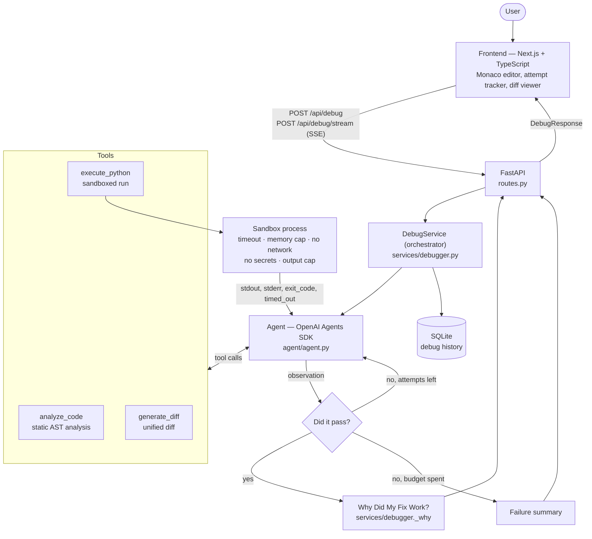

# Architecture

## 1. The shape of the system

Three processes: a Next.js frontend, a FastAPI backend holding the agent, and a throw-away
sandbox process per code execution. SQLite stores history. Nothing else.



## 2. Why these pieces

| Decision | Reason |
|---|---|
| **OpenAI Agents SDK** over LangGraph | The loop is one agent with three tools. The SDK gives tool calling and the run loop in ~40 lines; LangGraph's graph abstraction would add concepts without removing code. |
| **Orchestrator around the agent** | The LLM decides *what* to try; `DebugService` decides *what counts as true*. Success comes from the sandbox exit code, never from the model's claim. |
| **Static analyzer as a real tool** | Grounds the model in facts (exact line, exact cause) and gives a usable fallback when the LLM is unreachable. |
| **SSE for the fix endpoint** | The agent loop takes several seconds. Streaming attempt events is what makes the loop *visible*, which is the point of the project. |
| **SQLite, one table** | History is a convenience feature. A JSON blob per session is enough. |

## 3. Backend layout

```
backend/app/
├── main.py              FastAPI app factory, CORS, error handlers
├── config.py            Settings from environment variables
├── errors.py            AppError / LLMError -> safe JSON, never a stack trace
├── api/routes.py        /api/debug, /api/debug/stream, /api/debug/history, /api/health
├── agent/
│   ├── agent.py         LLM client, the three @function_tool definitions, attempt recorder
│   ├── prompts.py       One prompt per job: explain, fix, why-it-worked
│   └── state.py         AgentState: the explicit, inspectable state object
├── tools/
│   ├── code_analyzer.py AST heuristics per error type (no LLM)
│   ├── code_executor.py SubprocessExecutor + DockerExecutor
│   └── diff_generator.py
├── services/
│   ├── debugger.py      The orchestrator: budget, ground truth, fallbacks, response
│   ├── explainer.py     Task 1 + the static fallback explanation
│   └── history.py       SQLite
└── models/schemas.py    Every request/response shape (Pydantic)
```

## 4. Agent state

One dataclass, deliberately flat and printable (`agent/state.py`):

```python
code, error, language, explanation_mode, expected_output   # inputs
analysis, explanation, current_fix, diagnosis, changes,
reasoning, diff                                            # reasoning outputs
execution_output, execution_error, attempts, max_attempts,
fix_verified                                               # observations
why_it_worked, concepts                                    # teaching outputs
tool_trace, warnings, analyzed_since_last_run              # bookkeeping
```

`AgentContext` wraps the state plus the executor and an `emit` callback, and is handed to every
tool through the SDK's `RunContextWrapper`. Tools therefore mutate one shared, visible state
rather than passing hidden data around.

## 5. Request flow

### `POST /api/debug` with `mode: "explain"`

1. Validate (Pydantic). Blank code is rejected with a friendly message.
2. If no error text was supplied, run the code once to reproduce it (not counted as an attempt).
3. Call `analyze_code` — real AST analysis, recorded in the tool trace.
4. Send code + error + analysis to the explainer LLM with the chosen style prompt.
5. If the LLM fails, fall back to the static explanation and attach a warning.
6. Save to history, return `DebugResponse`.

### `POST /api/debug/stream` with `mode: "fix"`

Same first three steps, then the agent loop (next section). Progress is pushed as SSE events:
`status`, `tool_call`, `attempt_started`, `attempt_running`, `attempt_result`, then `result` or
`error`.

## 6. The sandbox

`execute_python` never runs code in the API process. Each run gets a fresh temp directory and a
child process started with `python -I -S -B runner.py`:

- **Timeout** — wall-clock deadline; the whole process group is killed (`SIGKILL`).
- **CPU / memory / file-size / fd limits** — `setrlimit` inside the child (POSIX).
- **No secrets** — the child's environment is built from scratch; `OPENAI_API_KEY` is absent.
- **No network** — `socket.connect`, `getaddrinfo` and friends are replaced with a raising stub.
- **No stdin** — `/dev/null`, so `input()` raises `EOFError` instead of hanging forever.
- **Stdlib only** — `-S` keeps site-packages off the path, so user code cannot import the backend's
  own dependencies.
- **Output cap** — streams are written to files and read back truncated; a flood kills the process.
- **Clean tracebacks** — the wrapper's own frames are stripped, so the user sees the same
  traceback `python main.py` would print.

`EXECUTION_BACKEND=docker` swaps in `DockerExecutor`: `--network none`, `--read-only`,
`--cap-drop ALL`, `--pids-limit`, memory caps, and a read-only mount of the work directory. It
falls back to the subprocess backend with a log line if Docker is unavailable.

**This is a college project, not a production sandbox.** The subprocess backend can still read
files the backend user can read. Do not expose it publicly.

## 7. Error handling

Every failure has a user-facing message and no stack trace:

| Situation | Result |
|---|---|
| Blank code / bad mode | 422 with a plain-English message |
| Non-Python language | 400 `unsupported_language` |
| No LLM key, `mode=fix` | 503 `llm_not_configured` |
| No LLM key, `mode=explain` | 200, static analysis + warning |
| Provider auth / rate limit / timeout / unreachable | mapped `llm_*` code and message |
| Malformed LLM JSON | one retry, then static fallback or recorded attempts |
| Agent never called the tool | the orchestrator executes its code itself and warns |
| Agent exceeded the budget | 200 `status: "failed"` with every attempt shown |
| Code times out / floods output | a normal failed attempt the agent can reason about |
| Anything unexpected | 500 `internal_error`, full trace to the server log only |
